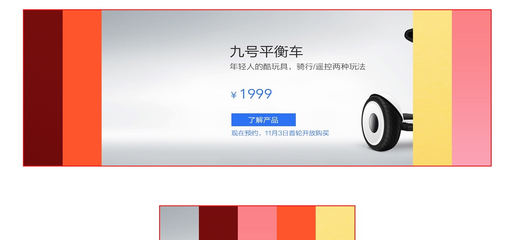

## Blinds
```javascript
/**
 * 作者： tetegw
 * 描述： 定位版百叶窗（手风琴）原生JS插件（IE9+）
 * =============================================================================
 * 调用： var newsfq = new Blinds({			创建Blinds
        	wrapId: 'box',
    	 });
 * 参数：
 * 		 wrapId: 'box'   					盒子Id（必填）
 * 		 imgurl: [							图片地址（必填；相对于本js的路径；个数随意）
	             'images/1.jpg',
	             'images/2.jpg',
	             'images/3.jpg',
	             'images/4.jpg',
	             'images/5.jpg',
	         ],
	     minWid: 100,						收缩的最小宽度（选填，默认值100）
	============================================================================
	html/css要求： 盒子css样式 width,height; 如下：
				  #wrapper{
				        width: 500px;
				        height: 200px;
			       }
 */
```

### 效果如图



